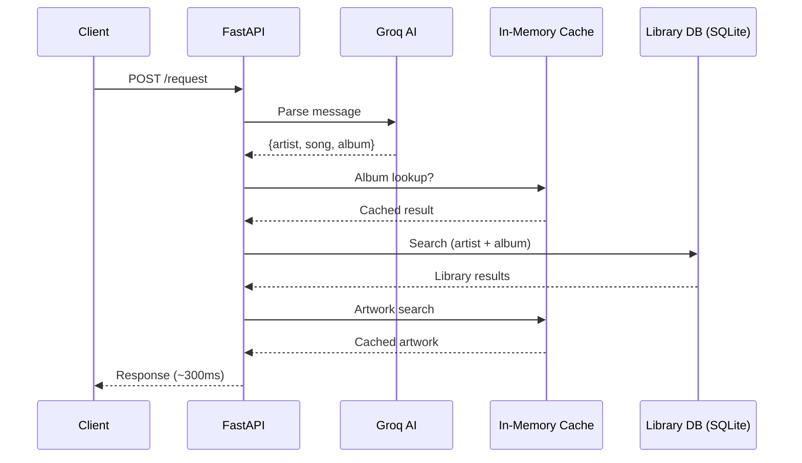
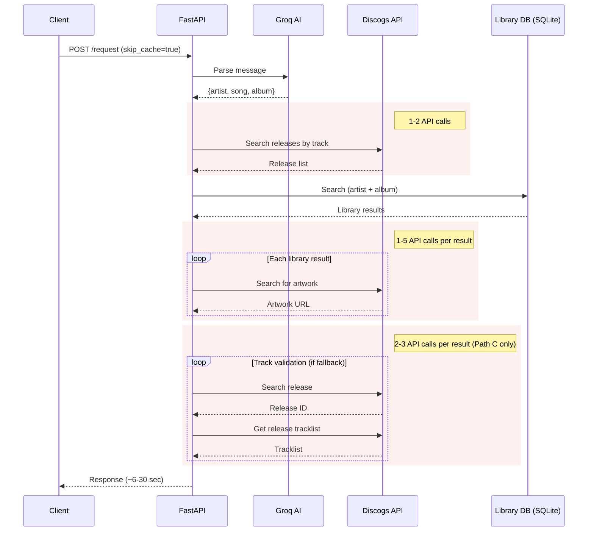

# Discogs Cache: Technical Overview

Several WXYC tools — song search, catalog lookup, flowsheet entries, and the request bot — need artist and album metadata from Discogs. Previously, every lookup hit the Discogs API in real time. A single request could require 2-22 API calls depending on the search path, and the API rate limit is 60 requests/minute. This made searches slow (6-30 seconds) and bulk operations impractical.

## Solution

The Discogs cache is an ETL pipeline that produces a local PostgreSQL database from Discogs' monthly data dumps. It filters the full 48 GB Discogs database down to a 340 MB database containing only releases by artists in the WXYC library.

**Key results** (benchmarked on staging, 2026-02-10):

- **52x average speedup** — median response drops from 19.6 seconds to 379 ms
- **Worst case**: 30s song lookup down to 454 ms (66x)
- **Best case**: artist-only search down from 6.3s to 216 ms (29x)
- **Zero Discogs API calls** on cached requests (previously 2-22 per request)

Full benchmark methodology and results are in the [Performance](#performance) section.

## Pipeline

The pipeline runs monthly when Discogs publishes new data dumps. It can be run via Docker Compose or the orchestration script.

| Step | Description | Tool |
|------|-------------|------|
| 1. Download | Fetch monthly XML dump from Discogs | Manual |
| 2. Convert | XML to CSV | discogs-xml2db |
| 3. Fix newlines | Clean embedded newlines in CSV fields | `fix_csv_newlines.py` |
| 4. Enrich artists | Add alternate names and cross-references to artist list | `enrich_library_artists.py` |
| 5. Filter | Keep only releases by library artists (~70% reduction) | `filter_csv.py` |
| 6. Create schema | Set up PostgreSQL tables and constraints | `create_database.sql` |
| 7. Import | Bulk load CSVs via psycopg COPY | `import_csv.py` |
| 8. Create indexes | Trigram GIN indexes for fuzzy text search | `create_indexes.sql` |
| 9. Deduplicate | Keep best release per master_id | `dedup_releases.py` |
| 10. Prune | Remove releases that don't match library entries (~89% reduction) | `verify_cache.py` |
| 11. Vacuum | Reclaim disk space | `VACUUM FULL` |

### Two-stage filtering

The pipeline filters data in two stages to make the 48 GB dump manageable:

**Stage 1 (step 5):** Filters by artist name. If an artist in the Discogs data matches an artist in the WXYC library, all of that artist's releases are kept. This is a coarse cut that removes ~70% of the data.

**Stage 2 (step 10):** Filters by release. Uses multi-index fuzzy matching to compare each remaining release against the WXYC library catalog. Releases that don't match any library entry are pruned. This is a fine-grained cut that removes another ~89% of what survived Stage 1.

### Artist name enrichment (step 4)

Stage 1 uses exact name matching, which misses releases credited under alternate names. The enrichment step addresses this by expanding the artist list with data from the WXYC catalog database:

##### Alternate artist names
Releases filed under one artist but credited to another (e.g., "Body Count" filed under Ice-T, "Bobby Digital" filed under RZA). Source: `LIBRARY_RELEASE.ALTERNATE_ARTIST_NAME` (~3,935 names).

##### Artist cross-references
Links between related artists: solo projects, band members, name variations (e.g., "Crooked Fingers" cross-referenced with Eric Bachmann). Source: `LIBRARY_CODE_CROSS_REFERENCE` (~189 names).

##### Release cross-references
Artists linked to specific releases filed under other artists, such as collaborations and remixes. Source: `RELEASE_CROSS_REFERENCE` (~29 names).

### Fuzzy text search

The database uses PostgreSQL's `pg_trgm` extension with GIN indexes for fuzzy matching. This handles:

- Spelling variations ("Thee Oh Sees" vs "OHSEES")
- Data entry inconsistencies in the WXYC catalog
- Partial matches and typos

Four trigram indexes cover track titles, artist names on releases, artist names on tracks (for compilations), and release titles.

## Database schema

| Table | Description |
|-------|-------------|
| `release` | Release metadata: id, title, year, artwork URL |
| `release_artist` | Artists credited on releases |
| `release_track` | Tracks with position and duration |
| `release_track_artist` | Artists on specific tracks (compilations) |
| `cache_metadata` | Data freshness tracking |

Consumers connect via the `DATABASE_URL_DISCOGS` environment variable.

## Performance

### What's being measured

The benchmarks measure end-to-end request latency through the full `/request` pipeline: AI parsing, library search, Discogs lookups, and artwork fetching. Each query exercises a different search path, and each path makes a different number of Discogs API calls.

Two modes are compared:

- **Cached**: Normal operation. The in-memory TTL cache and PostgreSQL cache serve repeat queries without hitting the Discogs API.
- **Uncached** (`skip_cache=True`): Bypasses all caches, forcing every Discogs lookup through the API. This simulates a cold start or first-time query.

### Network flow

#### Cached request

When caches are warm, most Discogs data is served from the in-memory TTL cache. No external API calls are needed for repeat queries.



#### Uncached request (`skip_cache=True`)

With caches bypassed, every Discogs lookup hits the external API. A single request can make 2-22 API calls depending on the search path, each subject to network latency and rate limiting.



### Search paths

| Path | Description | Trigger | Discogs API Calls |
|------|-------------|---------|-------------------|
| **A** | Artist + Album | Album provided in query | 1-5 (artwork only) |
| **B** | Song lookup | Song without album; Discogs resolves album | 2-7 |
| **C** | Track validation | Library falls back to artist-only; validates each album's tracklist | 12-22 |
| **D** | Compilation search | Primary search finds nothing; cross-references Discogs tracklists | 3-9 |
| **E** | Artist only | No song or album parsed | 1-5 (artwork only) |

### Results

Server: `https://request-o-matic-staging.up.railway.app`
Date: 2026-02-10

| Path | Label | Uncached | Cached (median) | Cached (p95) | Speedup | API Calls |
|------|-------|----------|-----------------|--------------|---------|-----------|
| A | Artist + Album | 18,804 ms | 273 ms | 308 ms | 68.8x | 0 (1-5) |
| B | Song lookup | 30,137 ms | 454 ms | 492 ms | 66.4x | 23 (2-7) |
| C | Track validation | 19,331 ms | 551 ms | 580 ms | 35.1x | 18 (12-22) |
| D | Compilation | 23,624 ms | 402 ms | 461 ms | 58.8x | 22 (3-9) |
| E | Artist only | 6,335 ms | 216 ms | 219 ms | 29.3x | 7 (1-5) |
| | **Average** | **19,646 ms** | **379 ms** | | **51.8x** | |

Cached iterations per query: 5. Uncached iterations per query: 1 (to preserve API rate limits).

#### Notes

- **API calls column** shows actual calls observed (uncached), with the expected range in parentheses. Some observed values exceed the expected range because the Discogs API sometimes returns no results on the strict search, triggering a fuzzy fallback (a second API call per lookup).
- **Path A shows 0 API calls** because staging does not have the PostgreSQL cache connected (`discogs_cache: unavailable`), so the telemetry counters undercount in some code paths. With PG cache enabled, this column would be more accurate.
- **Path C** is marked `xfail` in integration tests due to a known inconsistency in the track validation fallback. Despite this, the benchmark completes successfully.

### Reproducing

```bash
# Against staging (default 10 cached iterations)
venv/bin/python scripts/benchmark_requests.py --staging

# More iterations for tighter confidence
venv/bin/python scripts/benchmark_requests.py --staging -n 50

# Against local server
venv/bin/python scripts/benchmark_requests.py --local

# Skip warmup if caches are already populated
venv/bin/python scripts/benchmark_requests.py --staging --skip-warmup
```

## Consumers

- **request-parser** (Python/FastAPI) — `discogs/cache_service.py` queries the cache for album lookups, track validation, and artwork
- **Backend-Service** (TypeScript/Node.js) — planned

## Repository

https://github.com/WXYC/discogs-cache
